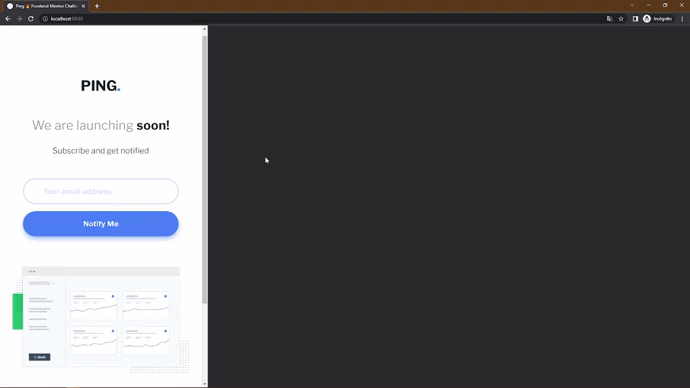
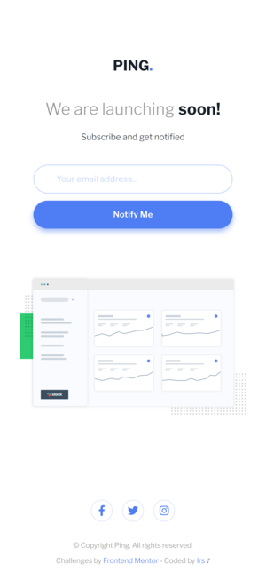
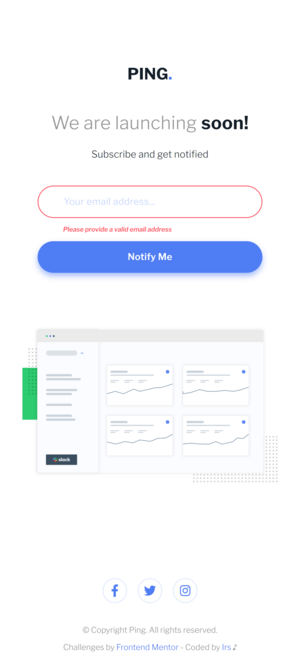
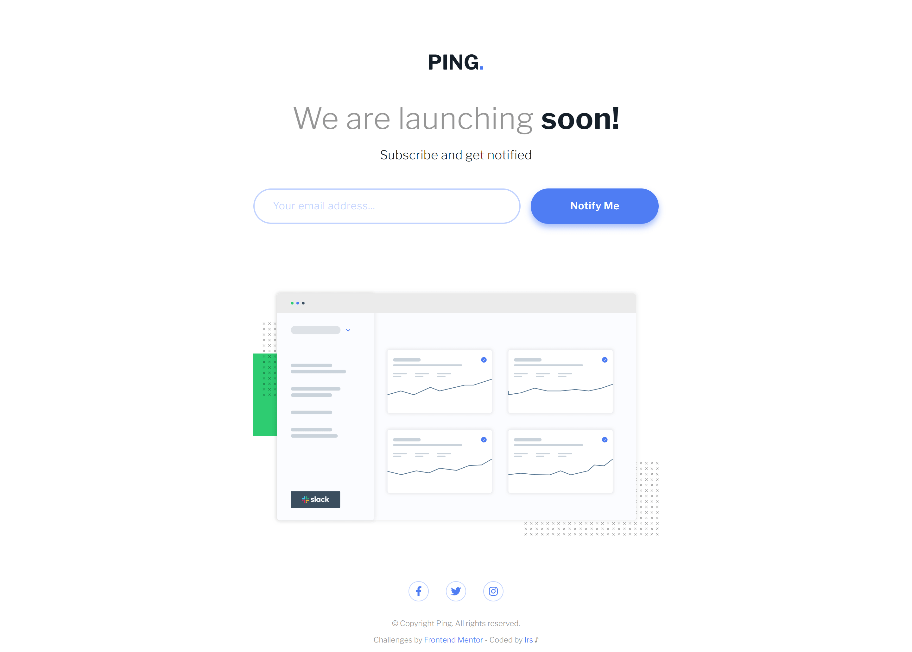
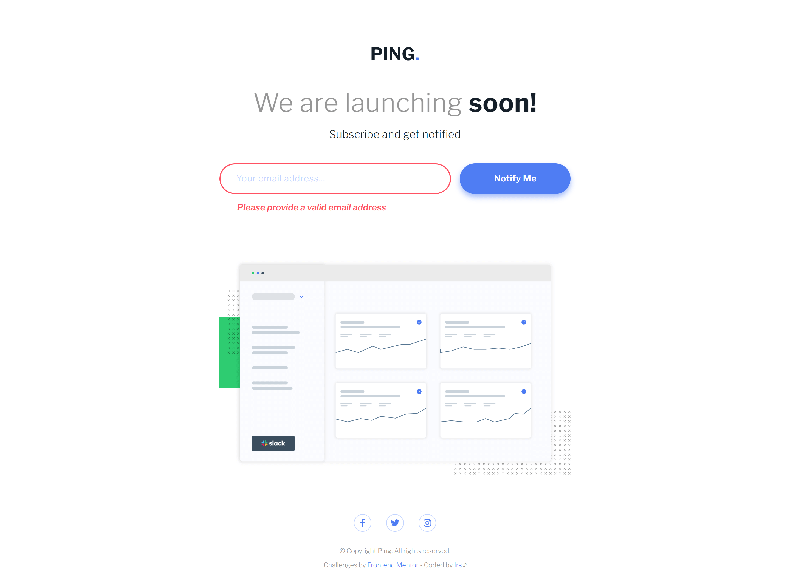

# Frontend Mentor - Ping coming soon page solution

Hi everyone 👋

This is a solution to the [Ping coming soon page challenge on Frontend Mentor](https://www.frontendmentor.io/challenges/ping-single-column-coming-soon-page-5cadd051fec04111f7b848da). 



## Table of contents

  - [The challenge](#the-challenge)
  - [Screenshot](#screenshot)
  - [Link](#link)
  - [Built with](#built-with)
  - [What I learned](#what-i-learned)
  - [Useful resources](#useful-resources)
  - [Author](#author)


## The challenge

Users should be able to:

- View the optimal layout for the site depending on their device's screen size
- See hover states for all interactive elements on the page
- Submit their email address using an `input` field
- Receive an error message when the `form` is submitted if:
	- The `input` field is empty. The message for this error should say *"Whoops! It looks like you forgot to add your email"*
	- The email address is not formatted correctly (i.e. a correct email address should have this structure: `name@host.tld`). The message for this error should say *"Please provide a valid email address"*

## Screenshot

- Mobile





- Desktop





## Link

- [Live site URL here](https://irs-mp.github.io/ping-soon-page/) 👀

## Built with

- Mobile-first workflow
- Semantic HTML5 markup
- CSS custom properties
- Flexbox
- CSS Grid

## What I learned

- The resize event fires when the document view (window) has been resized:

```js
window.addEventListener('resize', () => {
  ... })
```

- Validate an email field with regular expressions:

```js
const regExp = /[a-z0-9!#$%&'*+/=?^_`{|}~-]+(?:\.[a-z0-9!#$%&'*+/=?^_`{|}~-]+)*@(?:[a-z0-9](?:[a-z0-9-]*[a-z0-9])?\.)+[a-z0-9](?:[a-z0-9-]*[a-z0-9])?/g
```

## Useful resources

- [Regular Expressions](https://regexr.com/) - A great tool for creating regular expressions

## Author

- Frontend Mentor - [@Irs-mp](https://www.frontendmentor.io/profile/Irs-mp)
- Twitter - [@Irs-mp](https://twitter.com/Irs_mp)

